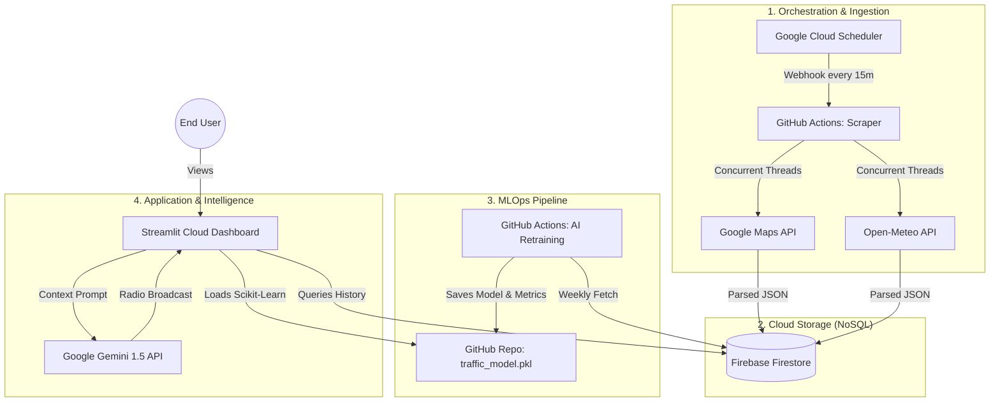

#  Dar es Salaam Smart City: Traffic & Weather Engine

###  [Live Dashboard: View the Dar es Salaam Command Center Here](https://dartrafficproject-johnmziray.streamlit.app/)

##  Project Overview

An automated, cloud-native **Data Engineering Pipeline & Intelligence Dashboard** that monitors real-time traffic congestion and meteorological conditions across major arterial corridors in **Dar es Salaam, Tanzania**.

By synchronizing high-resolution time-series data from Google Maps and Weather APIs into a NoSQL Cloud Database, this project builds a "Digital Twin" of the city's mobility patterns. The system features a **Gemini 1.5-powered Radio Broadcast** and an **MLOps Predictive Engine** to generate live commute reports and advanced business analytics.

---

##  System Architecture

> _The system uses a decoupled, high-performance architecture to ensure the frontend, data ingestion, and AI training environments operate independently._

1.  **Orchestration:** **Google Cloud Scheduler** sends a precise 15-minute HTTP webhook to GitHub.
2.  **High-Speed Ingestion:** GitHub Actions uses Python's `ThreadPoolExecutor` for concurrent scraping, reducing ingestion time by 90%.
3.  **Storage:** Live and historical data snapshots are pushed securely to **Google Cloud Firestore (Firebase)**.
4.  **GenAI Intelligence:** **Google Gemini 1.5 Flash** analyzes city-wide telemetry to generate dynamic "Radio Broadcast" commute advice.
5.  **Automated ML:** A separate workflow crunches historical data weekly using Scikit-Learn to refine traffic predictions and track Model Drift (MAE & R²).
6.  **Visualization:** **Streamlit Cloud** renders live 3D geospatial maps and professional BI heatmaps.

---

##  Key Intelligence Features

-  **100% Autonomous Pipeline:** Powered by a 15-minute sync cycle controlled by Google Cloud.
-  **AI Radio Broadcast:** Dynamic commute reports generated by Google Gemini.
-  **Advanced BI Analytics:** Interactive Heatmaps, Weather Correlation Box Plots, and Cost of Congestion metrics.
-  **3D Geospatial Mapping:** Real-time city congestion heatmap using `Pydeck`.
-  **Enterprise Security:** Secure GitHub Secret vaulting and dual-environment Firebase authentication.

---

##  Tech Stack & Tools

  
  
  
  
  
  

---

##  Engineering Milestones

Building this enterprise-grade pipeline required overcoming real-world engineering hurdles:
1.  **I/O Bottleneck Optimization:** Refactored sequential API calls into asynchronous `ThreadPoolExecutor` processes to prevent server timeouts.
2.  **Separation of Concerns:** Isolated dependencies into `scraper_requirements.txt` vs `train_requirements.txt` to eliminate "Dependency Hell" in CI/CD.
3.  **Decoupled Orchestration:** Migrated from GitHub Cron (unreliable) to **Google Cloud Scheduler** for precise, guaranteed telemetry execution.

---

##  Roadmap

- [x] **Phase 1:** Migrate from flat CSVs to Cloud NoSQL (Firebase).
- [x] **Phase 2:** Implement **Gemini 1.5** for automated commute broadcasting.
- [x] **Phase 3:** Create a 15-minute automated concurrent scraper pipeline.
- [x] **Phase 4:** Develop an automated MLOps retraining loop and Advanced Analytics Dashboard.
- [ ] **Phase 5:** Develop a predictive traffic alerting system via WhatsApp API.

---

  <b>Built with Love for the Tanzania Developer Community</b> 
  <i>Data Engineering Portfolio by John Mziray</i>

